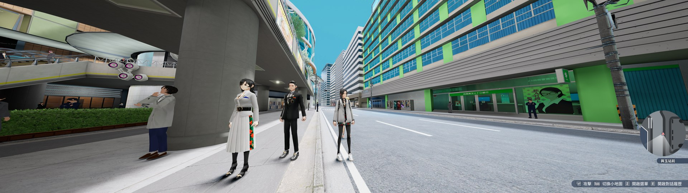

# CE2UltrawideFix — The Caligula Effect 2 Ultrawide Fix

[中文说明见下方](#中文说明)

A lightweight proxy-DLL patch that gives **The Caligula Effect 2** (UE 4.24, Epic Games Store PC build) proper ultrawide support: **21:9, 32:9, 48:9 and any other aspect ratio**, with correct field of view.

| Before (32:9, stock) | After (32:9, patched) |
|---|---|
|  |  |

## What it fixes

1. **Pillarboxed image** — the game locks every camera to a 16:9 aspect ratio (`FMinimalViewInfo.bConstrainAspectRatio`), so on wide screens you only see a cropped strip. The patch clears that constraint at runtime; the camera then follows the real viewport aspect ratio.
2. **Zoomed/cropped FOV** — the game forces `MaintainXFOV`, which shrinks the vertical FOV as the screen gets wider. The patch enforces `MaintainYFOV` (the engine default): vertical FOV stays exactly like 16:9, horizontal view expands naturally.

Both fixes are **aspect-ratio agnostic** — they simply stop the game from overriding what the engine would do by default. At 16:9 the patch is a no-op visually. Resizing the window to any shape (e.g. a 21:9 window) works live — verified at 3440x1440.

## Install

1. Download `CE2UltrawideFix_v1.0.zip` from [Releases](../../releases).
2. Extract into the game folder next to the exe:
   `TheCaligulaEffect2\TheCaligulaEffect2\Binaries\Win64\`
   (the folder that contains `TheCaligulaEffect2-Win64-Shipping.exe`)
3. Play.

Files placed: `X3DAudio1_7.dll` (the patch), `CE2UltrawideFix.ini` (optional toggles).

## Uninstall

Delete `X3DAudio1_7.dll`. The game exe is never modified — everything is patched in memory at runtime.

## Configuration

`CE2UltrawideFix.ini` (optional; delete it and both fixes stay on):

```ini
[CE2UltrawideFix]
EnableAspectFix=1
EnableFOVFix=1
```

A log is written to `CE2UltrawideFix.log` next to the exe every launch.

## Notes

- Cinematic letterbox bars in cutscenes are removed too (the view simply fills).
- The in-game graphics menu's resolution list is hardcoded by the game (max 3840x2160) — just leave the game in borderless fullscreen at your native resolution; if you accidentally switch, restart the game.
- The patch locates its targets with byte-pattern scans, not fixed addresses, so it should survive small game updates. Check the log if a big update breaks it.
- No anti-cheat in this game (single-player), nothing online is touched.

## How it works (technical)

UE 4.24, MSVC x64, single self-contained proxy DLL (`X3DAudio1_7.dll`, forwarding the two X3DAudio exports from System32 at runtime).

- **AspectFix**: pattern `8B 41 30 33 42 30 83 E0 01 31 41 30` is the `bConstrainAspectRatio` bit copy inside the two `FMinimalViewInfo` assignment routines. Patched to `and byte [rcx+0x30], 0xFE` (clears the bit unconditionally).
- **FOVFix**: finds `GEngine` via `48 8B 05 ?? ?? ?? ?? 48 8B 88 C0 07 00 00 48 85 C9 74` (GameViewportClient at `+0x7c0`), locates `GUObjectArray` via `48 8D 0D ?? ?? ?? ?? E8 ?? ?? ?? ?? 45 33 C9 4C 89 74 24 20`, enumerates live UObjects to find the `ULocalPlayer` (its `+0x70` field points back to the GameViewportClient), and every 500 ms rewrites `ULocalPlayer+0x94` (`AspectRatioAxisConstraint`) to `0` (`MaintainYFOV`).

## Build

Any recent MSVC (Visual Studio 2022) x64:

```
cl /LD /O2 /MT Source\CE2UltrawideFix.cpp /link /OUT:X3DAudio1_7.dll
```

No dependencies beyond the Windows SDK.

## License

MIT (this patch). The Caligula Effect 2 is © historia / NIS America — this project is not affiliated.

---

## 中文说明

给《卡里古拉2》（Caligula Effect 2，UE 4.24，Epic PC 版）的超宽屏补丁，支持 **21:9 / 32:9 / 48:9 及任意宽高比**，FOV 自动校准。

### 修复内容

1. **两侧黑边**：游戏把每个相机锁死在 16:9 宽高比，宽屏下只能看到中间一条。补丁在运行时解除该约束，相机跟随真实视口比例，画面铺满全屏。
2. **FOV 被放大裁切**：游戏强制 `MaintainXFOV`（越宽垂直裁得越狠）。补丁强制 `MaintainYFOV`（引擎默认）：垂直视野与 16:9 完全一致，横向视野自然扩展。

两个修复都不写死比例：16:9 下零副作用，拖窗口到任意尺寸即时生效。

### 安装

把 `X3DAudio1_7.dll`（和可选的 `CE2UltrawideFix.ini`）放进 `TheCaligulaEffect2\Binaries\Win64\`（和游戏 exe 同目录）即可。

### 卸载

删除 `X3DAudio1_7.dll`。游戏 exe 从未被修改——全部在内存中运行时补丁。

### 注意

- 过场动画的电影黑边也会消失（画面直接铺满）。
- 游戏画面设置里的分辨率列表是写死的（最大 3840x2160），别在里面改分辨率；改错了重启游戏即可恢复。
- 特征码定位，游戏小更新大概率不影响；失效请查看 `CE2UltrawideFix.log`。
